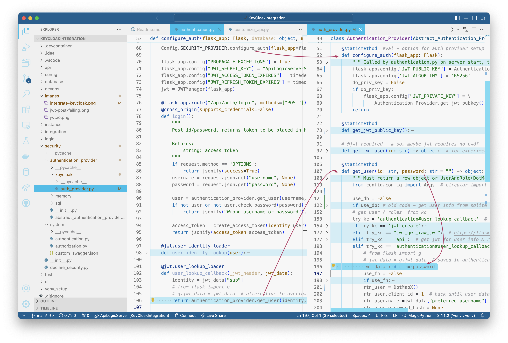

# Integration: ApiLogicServer + Keycloak

This repo contains a demo for apilogicserver integration with keycloak oidc JWT authentication.  It is an attempt to integrate this more natively into API Logic Server.

Status - 3/7:

1. able to access keycloak for login using modified sra at localhost.
2. not able to obtain jwt data for roles/authorization

&nbsp;

## Run:
```
cd devops/keycloak
docker-compose up
```

This will run keycloak on the docker host:
- keycloak (http://localhost:8080) 
    - use admin, password

&nbsp;

## Test:

### 1. Keycloak Unit Test

Verify keycloak login with demo, demo

```bash
# keycloak realm named "kcals"
KC_BASE=http://localhost:8080/realms/kcals

echo "\n\noidc token endpoint"
TOKEN_ENDPOINT=$(curl ${KC_BASE}/.well-known/openid-configuration | jq -r .token_endpoint)
echo "TOKEN_ENDPOINT: ${TOKEN_ENDPOINT} \n"

echo "retrieve an access token by logging in "
TOKEN=$(curl ${TOKEN_ENDPOINT} -d 'grant_type=password&client_id=alsclient' -d 'username=demo' -d 'password=demo' | jq -r .access_token)
echo "TOKEN: ${TOKEN} \n"

# test the authentication
curl http://localhost:5656/api/Category -H "Authorization: Bearer ${TOKEN}" | jq .

```

Aside - can use this as bearer... jwt.io will decode it

```python
data = {
            "grant_type": "password",
            "client_id": "alsclient",
            "username" :f"{username}",
            "password": f"{password}"
        }
        resp = requests.post(f"{TOKEN_ENDPOINT}", data)
        if resp.status_code == 200:
            resp_data = json.loads(resp.text)
            access_token = resp_data["access_token"]
            return jsonify(access_token=access_token)
```

### 2. Start APP Logic Server

Use first Run Config.

* If possible, I'd like to simplify setup, and make debugging easier, so trying to run the app natively.

&nbsp;

## Adapted Implementation

Several changes to adapt the original poc to API Logic Server structure:

1. **Keycloak Provider:** Moved `security/authentication_provider/sql/auth_provider` to its own dir: `security/authentication_provider/keycloak/auth_provider`
    * Moved the settings and `get_jwt_pubkey` to there
    * This centralizes all the keycloak elements in 1 place
    * There is a `config/config.py` setting to activate the Keycloak Provider.
        * This will later be a CLI command.
2. Updated `security/system/authentication.py` call a new `configure_auth` function in the Keycloak Provider.
    * This removes dependency on this file to provider type.
3. Added the docker compose material (including imports) to the `devops` dir
4. Note **interim SRA** is included in `ui/safrs-react-admin`
5. To login, see the `Auth` object in the admin app





## Initial Implementation (for reference)

- the `$PWD/projects` was mounted at `/projects` in the ApiLogicServer container
- A project named [`KCALS`](projects/KCALS) was created (default nw, with authentication):

```bash
mkdir projects
chmod 777 projects # we need to be able to write to this directory from the container
docker run  $PWD/projects:/projects -it apilogicserver/api_logic_server bash -c "ApiLogicServer create --project_name=/projects/KCALS --db_url= ; ApiLogicServer add-auth --project_name=/projects/KCALS"
```

For users to be able to authenticate with JWTs signed by keycloak, we have to download the JWK signing key from keycloak and use that to validate the JWTs. 
JWT validation is implemented in [projects/KCALS/security/system/authentication.py](projects/KCALS/security/system/authentication.py). 

By default, apilogicserver authentication uses a user database. Our users are defined in keycloak however. I had to change [auth_provider.py](auth_provider.py) for this to (kinda) work.

&nbsp;

## React-Admin

Nginx is used to host the safrs-react-admin frontend at http://localhost/admin-app .

&nbsp;

## Persisting Keycloak Data

keycloak data is stored inside the keycloak container in /opt/keycloak/data .
To make this persistent, you should mount this volume. Currently, only the "import" folder is mounted.
This import folder contains json files exported by me. These json files are imported when the container starts with the " --import-realm" command line switch ( https://www.keycloak.org/server/importExport )

You can try this:

```bash
$ mkdir data
$ mv import data # the import folder containing the json files
$ chmod 777 data # make sure the container keycloak user can write to this folder
```

Then, change the docker-compose keycloak volumes to:

    volumes:
        - $PWD/data:/opt/keycloak/data

This way, the /opt/keycloak/data will remain on the docker host mounted directory ($PWD/data)

&nbsp;

## Accessing the jwt at runtime

To retrieve user info from the jwt, you may want to look into these functions:
https://flask-jwt-extended.readthedocs.io/en/stable/automatic_user_loading.html
as used in security/system/authentication.py

&nbsp;
